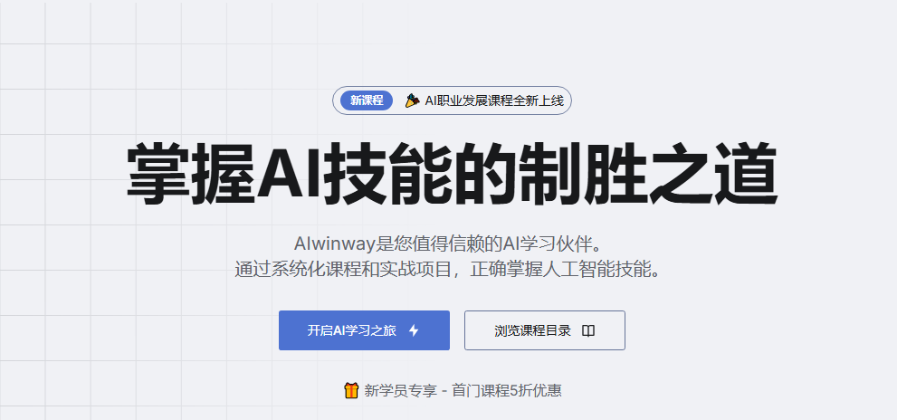

# ShipAny Template One

Ship Any AI SaaS Startups in hours. Thanks Adoubi for sharing this wonderful template.



## Quick Start

1. Clone the repository

```bash
git clone https://github.com/Tewboo/AIWallpaper_NoPorkbun.git
```

2. Install dependencies

```bash
pnpm install
```

3. Run the development server

```bash
pnpm dev
```

## Customize

- Set your environment variables

```bash
cp .env.example .env.development
cp .env.example .env.production
```

- Set your theme in `app/theme.css`

> Click here to set your theme: [shadcn-ui-theme-generator](https://zippystarter.com/tools/shadcn-ui-theme-generator)

- Set your landing page content in `i18n/pages/landing`

```Prompt
参考 @落地页 这个网页的内容，帮我修改这个落地页的json，以xxxxx先xxxxx为关键词，修改文案。
```

- 修改主页内容的首屏木粉，可以来这里，`components\blocks\hero\index.tsx`

- 调试修改的时候，先注释掉暂时不需要的部分，`app\[locale]\(default)\page.tsx`

```
    <>
      {page.hero && <Hero hero={page.hero} />}
      {/* {page.branding && <Branding section={page.branding} />}
      {page.introduce && <Feature1 section={page.introduce} />}
      {page.benefit && <Feature2 section={page.benefit} />}
      {page.usage && <Feature3 section={page.usage} />}
      {page.feature && <Feature section={page.feature} />}
      {page.showcase && <Showcase section={page.showcase} />}
      {page.stats && <Stats section={page.stats} />}
      {page.pricing && <Pricing pricing={page.pricing} />}
      {page.testimonial && <Testimonial section={page.testimonial} />}
      {page.faq && <FAQ section={page.faq} />}
      {page.cta && <CTA section={page.cta} />} */}
    </>
```

- 修改若干细节，匹配上自己项目，`i18n\pages\landing\en.json`
  - Logo
  - 品牌名
  - 

- Set your i18n messages in `i18n/messages`

- 修改网站协议，`app\(legal)\privacy-policy\page.mdx`
- 修改网站条款，`app\(legal)\terms-of-service\page.mdx`

```Prompt
update privacy-policy according to landing page content @en.json with brand name "AI XXXXX", domain "aixxxxx.com", contact email is "jessejunjing@163.com"

update terms-of-service according to landing page content @en.json with brand name "AI XXXXX", domain "aixxxxx.com", contact email is "jessejunjing@163.com"
```

- 修改环境变量，`.env.development`

- 修改faq，`i18n\pages\landing\en.json`，对用户友好，对搜索殷勤友好

- 修改cta，让用户更容易下单

- 用户评价testimonial，阔以设置“disabled”：true关闭评价

- stats，数据阔以先隐藏掉

- 图标选择，`https://react-icons.github.io/react-icons/icons/ri`

- 生成组件之后，依次放入到components之后，然后放入到landing page.tsx，每一个组件都是一个单独的模块，可以做好了之后，放到需要的地方去

```
截图
帮我生成一个这样的组件
```

- 通过api来设置ai功能，`app\api\demo\gen-image\route.ts`，这里默认就是创建route.ts

- 通过debug来调试，`debug\apitest.http`，频繁使用这里进行调试

- types文件夹设置保存数据的typescript的验证，比如一个数据表wallpaper，有一些字段，就要去types里面创建wallpaper.d.ts来设置严格

- models里面设置数据库的功能，创建对应的名称，可以参考示例

- Vercel不支持保存到本地图片，只能搞网络云存储

- 配置Stripe，尝试使用测试卡stripe test card来解决

### 创建数据库

Supabase => Project Settings => DataAPI


```
# Set your Supabase URL and Anon Key，ANON可以不填
SUPABASE_URL = ""
SUPABASE_ANON_KEY = ""
SUPABASE_SERVICE_ROLE_KEY = ""
```

- SQL Editor 粘贴插入数据库，`data\install.sql`
- 进入Table Editor 查看是否数据库链接成功

### 登录鉴权

> 结合实际情况做登录Oauth，本地和线上需要两套

`openssl rand --base64 32`
AUTH_SECRET = "手动生成一段随机数"

- Github 登录
  - Setting - Developing Setting - Oauth app

记得这里的Authorization callback URL要注意HTTP还是HTTPS

```
# Github Auth
# https://authjs.dev/getting-started/providers/github
AUTH_GITHUB_ID = "xxxxxxxxxxxxxxxxx"
AUTH_GITHUB_SECRET = "xxxxxxxxxxxxxxxxx"
NEXT_PUBLIC_AUTH_GITHUB_ENABLED = "true"
```

### 配置管理员

```
ADMIN_EMAILS = ""
```

### 配置CloudFlare

- 配置域名，可以尝试下子域名是不是可以无限创建。

### 关键词密度

- 调整关键词密度
```Prompt
帮我修改落地页内容，提升一下aiwallpaper generator 关键词的
密度·为了有更好的 seo 效果
```

### 站点地图

```
<?xml version="1.0" encoding="utf-8" standalone="yes"?>
<urlset xmlns="http://www.sitemaps.org/schemas/sitemap/0.9">
  <url>
    <loc>https://tewboo.my/</loc>
    <lastmod>2025-04-11T10:00:00+00:00</lastmod>
  </url>
</urlset>
```

### 谷歌分析监控
```
填写谷歌分析id
NEXT_PUBLIC_GOOGLE_ANALYTICS_ID = ""
```


## Deploy

- Deploy to Vercel

[](https://vercel.com/new/clone?repository-url=https%3A%2F%2Fgithub.com%2Fshipanyai%2Fshipany-template-one&project-name=my-shipany-project&repository-name=my-shipany-project&redirect-url=https%3A%2F%2Fshipany.ai&demo-title=ShipAny&demo-description=Ship%20Any%20AI%20Startup%20in%20hours%2C%20not%20days&demo-url=https%3A%2F%2Fshipany.ai&demo-image=https%3A%2F%2Fpbs.twimg.com%2Fmedia%2FGgGSW3La8AAGJgU%3Fformat%3Djpg%26name%3Dlarge)

- Deploy to Cloudflare

1. Customize your environment variables

```bash
cp .env.example .env.production
cp wrangler.toml.example wrangler.toml
```

edit your environment variables in `.env.production`

and put all the environment variables under `[vars]` in `wrangler.toml`

2. Deploy

```bash
npm run cf:deploy
```

## Community

- [ShipAny](https://shipany.ai)
- [Documentation](https://docs.shipany.ai)
- [Discord](https://discord.gg/HQNnrzjZQS)

## License

- [ShipAny AI SaaS Boilerplate License Agreement](LICENSE)
